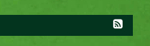

# RSS Feeds aktivieren in GCMS

Wenn auf einer Site das News-Modul (auch `tt_news` genannt) im Einsatz ist, was
grundsätzlich zu empfehlen ist, dann gibt es die Möglichkeit, die Meldungen
als RSS-Feed zu veröffentlichen.

## So wird der Feed aktiviert

Aktiviert ganz links im Typo3-Backend die Rubrik **Meine Webseite**, wie im nachstehenden Bild gezeigt.


Wählt dann im Seitenbaum die Wurzelseite der Site aus. Die Seite ist mit einem 
Icon gekennzeichnet, das eine Weltkugel und einen kleinen Pfeil in einem
grauen Quadrat zeigt. Im nachstehenden Beispiel ist das die Seite mit dem Namen
**OV Rösrath**. Bei Euch wird der Eintrag den Namen Eurer Site tragen.


Auf der Einstellungsseite, die sich nun öffnet, findet Ihr ganz unten einen
Absatz, der mit **rss pid** gekennzeichnet ist. Dort gibt es ein Drop-Down-Feld,
in dem Ihr die Seite auswählt, die bei Euch die News-Meldungen *auflistet*.

In unserem nachstehenden Beispiel werden die Meldungen auf der Seite aufgelistet, die den
Namen **Startseite** trägt.


Wenn Ihr Eure entsprechende Seite ausgewählt habt, klickt noch den **Speichern**
Button.

Das war es schon. Um den Effekt zu sehen, könnt Ihr nun am Fuß jeder Seite nach
dem kleinen weißen RSS-Icon Ausschau halten, wie hier gezeigt:



Im Quelltext Eurer Seiten findet Ihr außerdem ein zusätzliches Tag wie dieses:

```html
<link rel="alternate" type="application/rss+xml" href="/index.php?id=EURE-SEITEN-ID&type=100">
```

Damit wird Browsern und Suchmaschinen mitgeteilt, wo Euer Feed zu finden ist.
