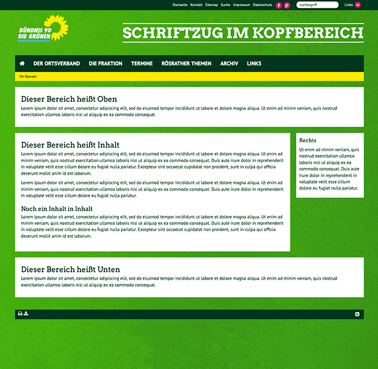
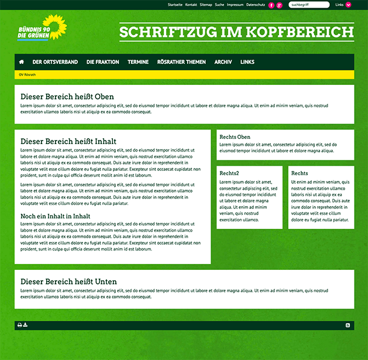

# Seitentypen

Grundsätzlich kann man im GCMS zwischen zwei verschiedenen Seitentypen auswählen.
Diese unterscheiden sich im Raster bzw. in den Feldern, die man mit Inhalt
bestücken kann, sowie in der Breite der Hauptspalte.

## Auswahl des Seitentyps

Welcher Seitentyp für eine Seite verwendet werden soll, kann unter **Bearbeiten > Erscheinungsbild** ausgewählt werden. Dort finden sich die Seitentypen im Drop-Down-Menü
unter **Backend-Layout (nur für diese Seite)**.

Die Seite **Bearbeiten** ist über den
Seitenbaum nach Klick auf das Icon einer Seite erreichbar.

## Seitentyp Classic

### Inhaltsbereiche (Spalten)

- **Oben**: Erscheint unterhalb des Menüs und oberhalb der Bereiche **Inhalt** und **Rechts**. Nutzt die gesamte Breite der Seite (1160 Pixel). Inhalte in Text-Inhaltsmpdulen können durch Ränder maximal 1120 Pixel breit sein. Zwischen einzelnen Inhaltsmodulen erscheinen Abstände, d. h. es gibt keinen gemeinsamen Hintergrund für die Inhalte dieser Spalte.
- **Unten**: Gleiche Abmessungen und Funktionsweise wie **Oben**
- **Inhalt**: Die Spalte ist insgesamt 915 Pixel breit. Inhalte können maximal 875 Pixel breit sein. Alle Inhaltsmodule in dieser Spalte erscheinen auf einem gemeinsamen weißen Hintergrund, d. h. es entstehen keine vertikalen Lücken zwischen Modulen.
- **Rechts**: Die Spalte ist 225 Pixel breit. Bild-Module erscheinen ohne Rand und können die gesamte Breite nutzen, Text-Inhaltsmodule jedoch wegen Rändern nur bis zu 205 Pixel. Zwischen einzelnen Inhaltsmodulen erscheinen Abstände, d. h. es gibt keinen gemeinsamen Hintergrund für die Inhalte dieser Spalte.

## Seitentyp 2 Rechte Spalten

### Inhaltsbereiche (Spalten)

- **Oben**, **Unten**, **Rechts** funktionieren wie in **Classic**
- **Inhalt**: Die Spalte ist 670 Pixel breit. Inhalte können davon maximal 630 Pixel nutzen. Alle Inhaltsmodule in dieser Spalte erscheinen auf einem gemeinsamen weißen Hintergrund, d. h. es entstehen keine vertikalen Lücken zwischen Modulen.
- **Rechts Oben**: Die Spalte ist 470 Pixel breit. Bild-Module können die gesamte Breite ausnutzen. Text-Inhaltstypen können durch Rahmen nur 450 Pixel nutzen. Zwischen einzelnen Inhaltsmodulen erscheinen Abstände, d. h. es gibt keinen gemeinsamen Hintergrund für die Inhalte dieser Spalte.
- **Rechts2** erscheint links von **Rechts** und funktionert genau so.

## Gemeinsamkeiten und Unterschiede

- Beide Seitentypen haben die Bereiche **Oben**, **Unten**, **Inhalt** und **Rechts**.
- Der Seitentyp **2 Rechte Spalten** hat darüber hinaus den Bereich **Rechts Oben** und **Rechts2**
- Der Bereich **Inhalt** ist bei beiden Seitentypen unterschiedlich breit.

## Gestaltungshinweise

Der Seitentyp **Classic** bietet den Vorteil, dass breitere Inhalte wie Abbildungen, Tabellen etc. gut platziert werden können.

**Aber**: Die Breite der Hauptspalte **Inhalt** im Seitentyp **Classic** ist, gemessen an der Schriftgröße, für das Lesen längerer Texte zu breit. Für optimale Benutzer*innenfreundlichkeit sollte man für längere Texte

- entweder den Seitentyp **2 Rechte Spalten** verwenden
- oder beim Seitentyp  **Classic** die Breite der Inhalte durch die Verwendung von Raster-Modulen eingeschränken.

Falls in den rechten Spalten Inhalte platziert werden, ist für eine ansprechende Optik bei beiden Seitentypen zu empfehlen, die Inhalte der Hauptspalte im Vergleich nicht deutlich kürzer werden zu lassen als die der Randspalte(n). Ideal ist, wenn die Hauptspalte die gleiche Höhe oder sogar eine größere Höhe aufweist, als die Randspalte(n).

Ebenso sollte bei Verwendung von **2 Rechte Spalten** der Inhalt der Spalte **Rechts** nicht höher sein als der der Spalte **Rechts2**. Umgekehrt jedoch ist das kein Problem.
